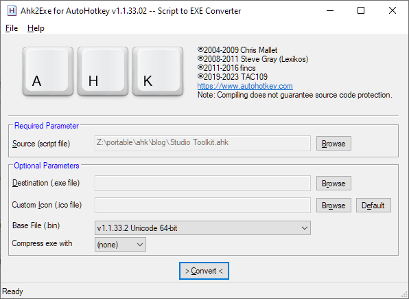
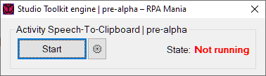
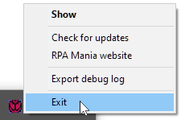
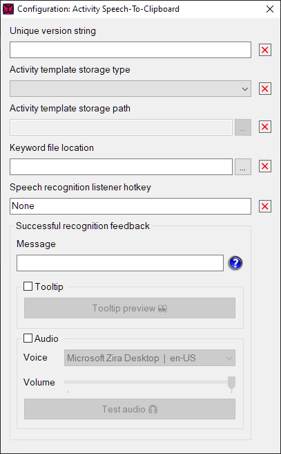
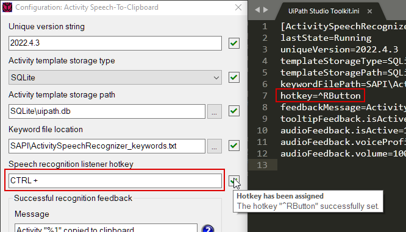
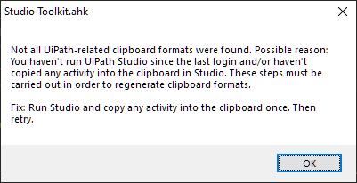

<!-- Improved compatibility of back to top link: See: https://github.com/othneildrew/Best-README-Template/pull/73 -->
<a name="readme-top"></a>
<!--
*** Thanks for checking out the Best-README-Template. If you have a suggestion
*** that would make this better, please fork the repo and create a pull request
*** or simply open an issue with the tag "enhancement".
*** Don't forget to give the project a star!
*** Thanks again! Now go create something AMAZING! :D
-->


<!-- PROJECT SHIELDS -->
<!--
*** I'm using markdown "reference style" links for readability.
*** Reference links are enclosed in brackets [ ] instead of parentheses ( ).
*** See the bottom of this document for the declaration of the reference variables
*** for contributors-url, forks-url, etc. This is an optional, concise syntax you may use.
*** https://www.markdownguide.org/basic-syntax/#reference-style-links
-->
[![Contributors][contributors-shield]][contributors-url]
[![Forks][forks-shield]][forks-url]
[![Stargazers][stars-shield]][stars-url]
[![Issues][issues-shield]][issues-url]
[![MIT License][license-shield]][license-url]
[![LinkedIn personal][linkedin-shield-personal]][linkedin-personal-url]
[![LinkedIn business][linkedin-shield-business]][linkedin-business-url]

<!-- PROJECT LOGO -->
<br />
<div align="center">
  <a href="https://github.com/RPAMania/Studio-Toolkit">
    
  </a>
<!-- </div> -->
<h1 align="center">Studio Toolkit</h1>

  <p align="center">
  <b>Working around hindrances and the mundane in UiPath Studio RPA software</b>
  <!-- </p> -->
  
  (ಠ益ಠ) _⚟_ _You were the chosen one! It was said that you would destroy recurrences, not join them._
  

  </p>

  <br />
  <!-- <a href="https://github.com/RPAMania/Studio-Toolkit"><strong>Explore the docs »</strong></a> -->
  <!-- <br /> -->
  <!-- <br /> -->
  <p align="center">
  <a href="https://github.com/RPAMania/Studio-Toolkit/issues">Report Bug</a>
  ·
  <a href="https://github.com/RPAMania/Studio-Toolkit/issues">Request Feature</a>
  </p>
</div>

<!-- TABLE OF CONTENTS -->
<!--
<details>
  <summary>Table of Contents</summary>
  <ol>
    <li>
      <a href="#about-the-project">About The Project</a>
      <ul>
        <li><a href="#built-with">Built With</a></li>
      </ul>
    </li>
    <li>
      <a href="#getting-started">Getting Started</a>
      <ul>
        <li><a href="#prerequisites">Prerequisites</a></li>
        <li><a href="#installation">Installation</a></li>
      </ul>
    </li>
    <li>
      <a href="#usage">Usage</a>
      <ul>
        <li><a href="#running-the-application">Running the application</a></li>
      </ul>
    </li>
    <li><a href="#roadmap">Roadmap</a></li>
    <li><a href="#contributing">Contributing</a></li>
    <li><a href="#license">License</a></li>
    <li><a href="#contact">Contact</a></li>
    <li><a href="#acknowledgments">Acknowledgments</a></li>
  </ol>
</details>
-->

<!-- ABOUT THE PROJECT -->
## About The Project

<!-- [![Product Name Screen Shot][product-screenshot]](https://example.com) -->

This projects aims to gradually eliminate common sources of repetition frequently faced by UiPath developers in their day-to-day job working with Studio IDE, __/(?:mouse-keyboard-)+mouse/ Rebound of Hell™__ in its various forms being among the most prevalent.

_Yo dawg! I herd u like automation so we put RPA in ur RPA so u can chill while u develop!_

### Built With

[![AHK-v1]][AHK-url]

<p align="right">(<a href="#readme-top">back to top</a>)</p>


<!-- GETTING STARTED -->
## Getting Started

To get a local copy up and running follow these simple example steps.

### Prerequisites

* Windows OS (tested with 10, should work with any version you can run UiPath Studio on)
* UiPath Studio (tested mostly with 2021.10.5, will likely work with any version from the most recent one to the oldest version you can still license)
* AutoHotkey binary executable (optional; required only if running source code directly or compiling from sources)

### Installation

If planning to...

- ...run a pre-built portable executable:
  1. Download the executable from the <a href="https://github.com/RPAMania/Studio-Toolkit/releases">GitHub releases page</a>.
- ...run source code directly:
  1. Clone/download the source repository.
  2. Download AutoHotkey v1.1.33.02. [<a href="https://www.autohotkey.com/download/1.1/AutoHotkey_1.1.33.02_setup.exe">installer</a> | <a href="https://www.autohotkey.com/download/1.1/AutoHotkey_1.1.33.02.zip">portable</a>]
- ...compile into a self-contained executable from sources:
  1. Clone/download the source repository.
  2. Download AutoHotkey script compiler and v1.1.33.02 Unicode 64-bit AutoHotkey base file. [<a href="https://www.autohotkey.com/download/1.1/AutoHotkey_1.1.33.02_setup.exe">installer</a> | <a href="https://www.autohotkey.com/download/1.1/AutoHotkey_1.1.33.02.zip">portable</a>]</a>
<!--
2. Clone the repo
   ```sh
   git clone https://github.com/RPAMania/Studio-Toolkit.git
   ```
3. Install NPM packages
   ```sh
   npm install
   ```
4. Enter your API in `config.js`
   ```js
   const API_KEY = 'ENTER YOUR API';
   ```
-->
<p align="right">(<a href="#readme-top">back to top</a>)</p>


<!-- USAGE EXAMPLES -->
## Usage

### Running the application...

- ...with a pre-built executable
  1. Run the executable.
- ...directly from sources using the AutoHotkey runtime binary
  1. Install Autohotkey or extract files from the downloaded portable version zip file.
  2. Using a shortcut created by you / run dialog (Win-R) / command prompt / etc. run the command
    ```cmd
    "path-to-AutoHotkeyU64.exe" "path-to-Studio Toolkit.ahk"
    ```
- ...after first compiling the sources
  1. Install AutoHotkey or extract files from the downloaded portable version zip file.
  2. Run the compiler GUI application located in the `Compiler` subfolder under the AutoHotkey installation / extraction directory.
  3. Select the `Studio Toolkit.ahk` in the source directory via the `Browse` button or by drag-and-dropping the file in the `Source (script file)` field, select the `1.1.33.2 Unicode 64-bit` Base File and press the `Convert` button.<p></p>
  4. Run a new `Studio Toolkit.exe` executable located in the source directory.

### About configuration

The application consist of a basic engine and a number of modules. The engine is a simple GUI housing a section for each loaded module. Modules themselves implement any number of features that work alongside and often in a close relationship with the UiPath Studio application.

The GUI of the main engine including one module with its respective section:
<p></p>

Each module will have a bare minimum of a `Start/Stop` button, a `⚙` configuration button and a run state indicator. Modules also have their individual version numbering independent of that of the engine.

Initially on engine startup, if a module requires configuring, its `Start` button will be disabled. __Only after configuration is complete and <ins>fully valid</ins> can a module be started.__ Documentation to each module's own configuration is found under module subheadings in this guide.

While a running module's configuration window is open, the module itself will be in a paused state and any module features remain stalled until the configuration window is closed.

### Exiting the application

Closing the engine GUI window will minimize it to the system tray. Any modules will remain in their current state and continue operating normally. To fully exit the application, right-click the system tray icon and select the `Exit` menu item. Any changes to modules' settings will be saved in the settings file `Studio Toolkit.ini` at this point.
<p></p>

<p align="right">(<a href="#readme-top">back to top</a>)</p>

### Troubleshooting the application

The application includes an option to export a log file. To do so, right-click the tray icon and select `Export debug log`. A log file may then be attached to a created <a href="https://github.com/RPAMania/Studio-Toolkit/issues">GitHub issue</a>.

## Module: Activity Speech-To-Clipboard

### Description of the issue the module is designed to address
<!-- On any subsequent reference to the user's hand operating the mouse (usually right, sometimes left), the term Mouse Hand™ will be used. -->

Ordinarily, to add a new activity in the project logic `Designer` pane, a user needs to take a number of actions. Whether you're used to retrieving a new activity using the search field of the `Activities` pane (`Ctrl–Alt–F`) or go with the `Universal Search` (`Ctrl–F`), there are quite a few intermediate steps and you'll find the hand you're using a mouse with not only often jumping between the mouse and the keyboard but you'll also have to move the mouse pointer back and forth.

<!--
Either

1. access the search field in the `Activities` pane (Ctrl–Alt–F)
2. move the Mouse Hand™ to the keyboard to participate in typing in the name of an activity to filter the listing
3. move the Mouse Hand™ back to the mouse, move the pointer over to the wanted activity, drag the activity into the `Designer` pane and drop it on an appropriate slot.

or

1. press Ctrl–F to bring forth the Universal search
2. move the Mouse Hand™ to the keyboard to participate in typing in the name of an activity to filter the listing
3. to have an activity appear at the latest point of interaction in the `Designer`, either<br />
a) move the Mouse Hand™ back to the mouse to point the cursor at the wanted activity and double-click<br />
b) move one of available hands to keyboard arrow keys to select the wanted activity and press Enter
4. drag a newly added activity from its place of entry into an appropriate slot in the `Designer`, if not already there.
-->

### How the module addresses the issue

The module aims to resolve the issue by delegating repetitive arm/hand movement to vocal cords: a user first configures a hotkey (combination) to operate Microsoft Speech API built into the Windows OS. Then a user, typically wearing a headset with a mic, issues spoken commands. On recognized keyword an activity of user's choice will be automatically placed in the clipboard, ready to be pasted into the `Designer`, reducing mandatory steps to `hold down the hotkey`, `say a keyword`, `release the hotkey`, `point & click the target spot`, `hit Ctrl–V to paste`—a process that requires little hand movement.

<!--  
, reducing steps to take to the following:

1. Press & hold the hotkey and speak the keyword bound to the wanted activity.
2. On confirmation of successful recognition, release the hotkey.
3. With your precious Mouse Hand™, move the cursor over the slot where the activity should appear and click the left button to indicate the target slot to paste to.
4. Hit Ctrl–V to paste the activity at the chosen spot.
-->

Benefits of the module include:
- lessening long term wear on your mouse hand.<br />
Consider alternating between voice and hands whenever the other input method begins to feel taxing. As far as extended speaking goes, a decent quality headset mic close to your mouth at sufficiently high input gain should let you use a soft voice and still get fairly reliable recognition results even when there's some office background noise. In a quiet home office setting you can have your kid peacefully sleep next to you while you're whispering commands.
- relieving a sense of frustration from repetition.<br />
While a fast and accurate typist will likely save no more than a handful of seconds per each added activity, any experienced UiPath dev knows how building a robust bot logic starts to mentally get to you over time. Even a small shortcut to what some days feels like a lifetime of stacking activities one after another will quickly become a major relief. _`It's the little streams that make the big rivers`._
- allowing quickly pasting even complex workflows.<br />
Just because there's been a mention of _an activity_ (singular) doesn't mean there can only be data associated with a single solitary activity bound to a keyword. Often times that may be exactly what you want, but there's certainly nothing to stop you from configuring a keyword to add, say, a boilerplate `Sequence` containing a dozen other activities, some having their properties pre-populated with values, to the clipboard on your command.
  ```
    (⌐■_■) Epic r0ckst4r devs have been known to paste entire projects ⁱⁿ ᵗʰᵉⁱʳ ᵈʳᵉᵃᵐˢ
  ```

### Configuration

After clicking the settings icon `⚙` in the main engine GUI, a module configuration window will appear:
<p></p>

The five topmost rows of input fields need to be configured to use the module. Hovering the mouse cursor over each validation indicator (red Xs in the image above) will display a message about the issue. Each symbol will turn into a green checkmark on successful field validation.

<p><a href="images/ActivitySpeechRecognizer_config.drawio.pdf">Configuration flowchart</a></p>

<p><a href="https://www.youtube.com/watch?v=yJGEeL4aqdg">Configuration video walkthrough</a></p>

#### Unique version string
<details>
<summary>Show/hide</summary>

The interpretation of the typed text in this field depends on what's been chosen as the `Activity template storage type`.

| Activity template storage type | Unique version string |
|--------------------------------|-----------------------|
|XMLFile|Together with the `Activity template storage path`, this value determines the path under which the module will look for XML files when it's searching for a match to a recognized keyword.<br /><br />Given the default directory structure of the repository where an example set of XML files are located under the relative path of `XML\Activities\2022.4.3_Classic`, this value sets the name of the last subdirectory, `2022.4.3_Classic`, at the end of the directory tree leading to XML files. As such, the unique version string allows quickly switching between sets of XML file activities stored in different subfolders per project / client / etc as needed.<br /><br />You may also find you'll never need more than one set of activities, in which case you'll choose a unique version string once and keep it fixed at all times.
|SQLite|This value determines how to filter SQL activity data based on the version information stored alongside each SQL activity data row. Given string will correspond to the SQLite database table `SpeechRecognitionActivity` column `version` value that'll be used to filter activity database rows when the module is searching for a match to a recognized keyword. Only matching activity data rows will be included in the search. The example database file has each activity row with `2022.4.3_Classic` as the version column value.<br /><br />Much like with the XMLFile option, the unique version string can be used as an SQL-style "routing switch" to select between different sets of activities a common list of keywords should correspond to.<br /><br />For details about the structure of the database, see the SQL file in `SQLite\scripts\recreate_speech_recognition_activity_table.sql`.

</details>

#### Activity template storage type

A storage type to use for searching and retrieving activity data. See the [`Unique version string`](#unique-version-string) for details.

In order to use SQLite database storage, you'll need a suitable SQLite DLL binary. Look for the heading `Precompiled Binaries for Windows` and download the <i>64-bit DLL (x64) for SQLite version 3.X</i> <a href="https://www.sqlite.org/download.html">here</a>. The application will request you to point the binary for it.

#### Activity template storage path
<details>
<summary>Show/hide</summary>

| Activity template storage type | Activity template storage path |
|--------------------------------|--------------------------------|
|XMLFile|This value determines most of the path under which the module will look for XML files when it's searching for a match to a recognized keyword.<br /><br />Given the default directory structure of the repository where an example set of XML files are located under the relative path of `XML\Activities\2022.4.3_Classic`, this value sets the fixed part of the path leading to the last subdirectory, i.e. `XML\Activities`. Both relative and absolute paths are supported. Network path compatibility is not guaranteed.
|SQLite|This value determines the path to the SQLite database file. Given the default directory structure of the repository, the location of an example SQLite database file is `SQLite\uipath.db`.|

</details>

#### Keyword file location
<details>
<summary>Show/hide</summary>

A path to a text file that specifies one keyword per line. While the module is running and the hotkey is being pressed down, the primary audio input device will be monitored for a match to any keyword in the file. Given the default directory structure of the repository, an example keyword file is in `SAPI\ActivitySpeechRecognizer_keywords.txt`. The default set includes following keywords:
|Keywords||||
|-------|-|-|-|
|Add Data Row|Deserialize Json Array|Invoke Method|Retry Scope|
|Assign|Do While|Invoke Workflow File|Select Item|
|Attach Browser|Element Exists|Log Message|Send Hotkey|
|Attach Window|Find Children|Message Box|Sequence|
|Break|Find Element|Multiple Assign|Start Process|
|Build Data Table|Flowchart|Navigate To|Throw|
|Click|For Each|Open Browser|Try Catch|
|Continue|Get Text|Read Range|Type Into|
|Delay|If|Rethrow|While|
|Deserialize Json|||

</details>

#### Hotkey
<details>
<summary>Show/hide</summary>

A hotkey to trigger input audio listening on and off while the module is running. Speech API will monitor the audio signal of the primary audio input device for keywords as long as the hotkey is being pressed down while the module is running.

To configure a trigger hotkey, focus the hotkey control and pressing desired keys. The hotkey input control widely supports most ordinary keys found in standard keyboards, the most notable exception being a Windows modifier key that isn't recognized. Also mouse buttons aren't supported.

However, the underlying hotkey mechanism built into the module will recognize any AutoHotkey-compatible hotkey combination, including the aforementioned Windows key as well as many special keyboard keys, mouse buttons and, if you're one of those wacky oddballs, even up to 32 joystick buttons.

Using a supported hotkey incompatible with the hotkey control requires manually editing the hotkey into the module settings file `Studio Toolkit.ini` that will be created after the first time you exit the toolkit application by right-clicking its tray menu icon and selecting `Exit`.


#### Setting a hotkey manually in the settings file

The settings file `Studio Toolkit.ini` will have a dedicated section for the module titled `[ActivitySpeechRecognizer]`. Inside the section you'll find key-value pairs separated by an equals sign `=`. The hotkey setting has `hotkey` as its key and the value follows <a href="https://www.autohotkey.com/docs/v1/KeyList.htm">AutoHotkey key syntax</a>.

To have manually edited modifications persist and get applied, make sure to <a href="#exiting-the-application">exit the application</a> before modifying the file.

<details>
<summary><ins>AutoHotkey key syntax cheat sheet</ins></summary>

|AutoHotkey symbol|Meaning|Notes|
|-----------------|-------|-----|
|^|Ctrl key|A combination must be completed with a non-modifier key.<br /><br />__Example__: `^q` ⇒ Ctrl-Q (also supported by the hotkey input control).<br /><br />Use `Ctrl` (any Ctrl key), `LCtrl` (only left Ctrl) or `RCtrl` (only right Ctrl) instead of `^` to bind the Ctrl key _by itself_ for monitoring the incoming audio. |
|!|Alt key|A combination must be completed with a non-modifier key.<br /><br />__Example__: `!Space` ⇒ Alt-Spacebar (supported only by editing the settings file, as Windows uses Alt-Space globally to invoke a window menu of a currently active window, which makes setting the hotkey via the input control impossible; also the Spacebar is not supported by the input control).<br /><br />Use `Alt` (any Alt key), `LALt` (only left Alt), `RAlt` (only right Alt where available) or `LCtrl & RAlt` (AltGr where available) instead of `!` to bind the Alt key _by itself_ for monitoring the incoming audio.|
|+|Shift key|A combination must be completed with a non-modifier key.<br /><br />__Example__: `+2` ⇒ Shift-2 (also supported by the hotkey input control).<br /><br />Use `Shift` (any Shift key), `LShift` (only left Shift) or `RShift` (only right Shift) instead of `+` to bind the Shift key _by itself_ for monitoring the incoming audio.|
|#|Windows key|A combination must be completed with a non-modifier key.<br /><br />__Example__: `#F1` ⇒ Windows–F1 (not supported by the hotkey input control because of the Windows key).<br /><br />Use `LWin` (only the left Windows key) or `RWin` (only the right Windows key where available) instead of `#` to bind the Windows key _by itself_ for monitoring the incoming audio.|
|LButton|Left mouse button|
|RButton|Right mouse button|__Example__: `^!+RButton` ⇒ Ctrl–Alt–Shift–Right mouse button. The order of modifier key symbols (^ for Ctrl, ! for Alt, + for Shift, # for Windows) doesn't matter.
|MButton|Middle mouse button|
|^#a|Ctrl–Win–A|
|<^>!m|AltGr–M|`<` and `>` can be used to indicate left and right counterparts of double modifier keys, the AltGr key being equivalent to `left Ctrl` and `right Alt` pressed together.
|>+-|Right Shift–(hyphen)|As the hotkey explicitly reserves the right Shift key with the hyphen, the left Shift–(hyphen) combination will still be available for typing the underscore `_` character.
|CapsLock & a|CapsLock–A|To use almost any ordinary key as a modifier like a Ctrl key, use the ampersand `&` separator between the two keys.<br /><br />NOTE: There has to be exactly one space character around the ampersand on both sides. Also you can only specify a combination of just one custom modifier and another key using this special syntax.<br /><br />NOTE: If you use this syntax to turn any ordinary key into a modifier, you'll lose the new modifier key's native function while pressing it down. You can still invoke the native function on release of the key, though, as long as it's pressed and released by itself without involving other keys.
</details>


<br />If a hotkey supported by the module but unsupported by a hotkey input control is edited into the settings file, upon running the application the hotkey control will display either a partial hotkey, `None` in the system language or seemingly unrelated text. However, as long as there's a green checkmark next to the hotkey input field, the chosen hotkey will work fine.
<p></p>

</details>

#### Recognition feedback message

A visual/auditive feedback message after a successful recognition and setting a matching activity in the clipboard have occurred. You may use a placeholder `%1` in the message to have it replaced by a title-cased recognized keyword.<br /><br />Example `"%1" placed into the clipboard` will appear as `"[keyword]" placed into the clipboard`.

#### Tooltip

Tick the checkmark to have a small visual tooltip appear for a few seconds on a successful recognition at the mouse cursor's current position. The tooltip will display <a href="#recognition-feedback-message">the feedback message</a>. Message display may be tested with the `Tooltip preview 👀` button.

#### Audio

Tick the checkmark to have one of available Speech API voices speak <a href="#recognition-feedback-message">the feedback message</a> into the primary audio output. There are options to select the voice / language out of installed ones and set the audio feedback volume level independently of the main audio playback volume. Audio output may be tested with the `Test audio 🎧` button.

### Using the module

Once up and running, first press and hold the chosen hotkey down, then speak a keyword. Any activated feedbacks should kick in on successful recognition, and the matching activity appear in the clipboard. Once a recognition has successfully taken place, you need to release and press the hotkey down again to reactivate audio listening.

If you get an error dialog like the one below instead of recognition feedback, dismiss the dialog, copy any activity once in the clipboard in UiPath Studio, and then retry.




### How to create new activity data

<details>
<summary>XML files</summary>

1. In Studio, copy any activity into clipboard.
2. Open a new text file and paste the clipboard into it. You may trim the leading `<?xml version="1.0" encoding="utf-16"?>` if you wish.
3. Save the file with the extension `.xml` into an XML activity folder matching a desired <a href="#unique-version-string">unique version</a> (repository default folder: `XML\Activities\2022.4.3_Classic`).<p>
_NOTE: The primary method how the module locates an XML activity file is to look at the name of the file after the final dot (`.`), or an entire name if dotless. For example, the keyword `assign` will match the file `System.Activities.Statements.Assign.xml`. If no matching file is found, the secondary method will try to locate a suitable file by reading the 2nd line of text (if available) from each XML file, and comparing it with the keyword. To configure the secondary method, place a text string matching a keyword by itself into the 2nd line of the XML file, without any tags._</p><p>
_Most activities in the default set supplied with the repository conform to the primary locating method, and have been named following .NET namespace and class naming scheme for each activity, i.e. the `Assign` activity's file name is `System.Activities.Statements.Assign.xml`._</p><p>
_A handful of activities have class names that don't match activity display names as known to UiPath Studio users. One well-known example is the activity `Get Text` whose .NET class name is `GetValue`, and the XML file name including the namespace is `UiPath.Core.Activities.GetValue.xml`. For this reason, the XML file has a second line of text with content `Get Text` in order to allow a user to refer to the activity using its most familiar display name._</p>
Choose a file name accordingly based on what keyword you're planning to use, or pick whatever file name suits you best and place the keyword into the second line prior to saving.
4. Add a keyword matching the file name or text on the second line of the XML file into the keywords file in `SAPI\ActivitySpeechRecognizer_keywords.txt`.
5. Restart the Toolkit application.

</details>

<details>
<summary>SQLite database</summary>

1. In Studio, copy any activity into clipboard.
2. Open a new text file and add following content to it:
```sql
INSERT INTO SpeechRecognitionActivity (version, name, xml) VALUES ('[version]', '[name]', '[clipboard]');
```
where
- `[version]` is a desired <a href="#unique-version-string">unique version</a> string
- `[name]` is the <a href="#keyword-file-location">keyword</a> by which the activity should be recognized
- `[clipboard]` is pasted text content of what was copied in step 1. You may trim the leading `<?xml version="1.0" encoding="utf-16"?>` if you wish.
3. Save the text file with the extension `.sql` into the SQLite activity SQL file folder `SQLite\scripts\SpeechRecognitionActivities`. File name is irrelevant; only the extension matters.
4. Run the batch file `SQLite\reset_speech_recognition_table.bat` to recreate the activity database table with SQL files in the activity file folder.
5. Add a keyword matching the `name` column value into the keywords file in `SAPI\ActivitySpeechRecognizer_keywords.txt`.
6. Restart the Toolkit application.<p>

</details>

<p align="right">(<a href="#readme-top">back to top</a>)</p>

<!-- ROADMAP -->
## Roadmap

- [ ] Port the entire app to AHK v2.
- [ ] Fix DPI scaling issues.
- [ ] Module `Activity Speech-to-Clipboard`: A feature to allow creating new activity data directly inside the application.
- [ ] Module `Activity Speech-to-Clipboard`: Add an in-app option to convert installed WinRT voices to SAPI voices with an automatic registry edit. This will bring the full list of voices to choose from, as displayed in Windows 10 `Settings app → Speech → Additional speech settings → Choose a voice`.
- [ ] A new module: Targeting both the `Properties` panel and certain subwindows (`Invoked workflow's arguments` dialog / `Dictionary` type property's key-value pair dialog), enable moving from an input field on one row to a next / previous one with a single press of a `Tab` / `Shift–Tab` instead of normal operation that typically requires four or five consecutive presses.
- [ ] A new module: Allow importing commonly used namespaces, such as `System.Text.RegularExpressions` or `Newtonsoft.Json.Linq`, with a press of a hotkey.
- [ ] A new module: Allow setting up hotkeys to paste code text snippets, such as `.ToString`, `.AsEnumerable` or `DirectCast(objectVariableOfUnderlyingDataRowType, DataRow)("").ToString`.


See the [open issues](https://github.com/RPAMania/Studio-Toolkit/issues) for a full list of proposed features (and known issues).

<p align="right">(<a href="#readme-top">back to top</a>)</p>


<!-- CONTRIBUTING -->
## Contributing

To be published later...
<!--
Contributions are what make the open source community such an amazing place to learn, inspire, and create. Any contributions you make are __greatly appreciated__.

If you have a suggestion that would make this better, please fork the repo and create a pull request. You can also simply open an issue with the tag "enhancement".
Don't forget to give the project a star! Thanks again!

1. Fork the Project
2. Create your Feature Branch (`git checkout -b feature/AmazingFeature`)
3. Commit your Changes (`git commit -m 'Add some AmazingFeature'`)
4. Push to the Branch (`git push origin feature/AmazingFeature`)
5. Open a Pull Request~~
-->

<p align="right">(<a href="#readme-top">back to top</a>)</p>


<!-- LICENSE -->
## License

Distributed under the MIT License. See <a href="LICENSE">`LICENSE`</a> for more information.

<p align="right">(<a href="#readme-top">back to top</a>)</p>


<!-- CONTACT -->
## Contact

Da man himself, TJay🐦: https://www.rpamania.net/#contact

Project Link: [https://github.com/RPAMania/Studio-Toolkit](https://github.com/RPAMania/Studio-Toolkit)

<p align="right">(<a href="#readme-top">back to top</a>)</p>


<!-- ACKNOWLEDGMENTS -->
## Acknowledgments

* AHK-just-me: [SQLite database library](https://github.com/AHK-just-me/Class_SQLiteDB/tree/master/Sources_v1.1)
* Uberi: [SAPI speech recognition library](https://gist.github.com/Uberi/6263822)
* RaptorX: [Original unmodified script update function](https://github.com/RaptorX/ScriptObj)

<p align="right">(<a href="#readme-top">back to top</a>)</p>


<!-- MARKDOWN LINKS & IMAGES -->
<!-- https://www.markdownguide.org/basic-syntax/#reference-style-links -->
[contributors-shield]: https://img.shields.io/github/contributors/RPAMania/Studio-Toolkit.svg?style=for-the-badge
[contributors-url]: https://github.com/RPAMania/Studio-Toolkit/graphs/contributors
[forks-shield]: https://img.shields.io/github/forks/RPAMania/Studio-Toolkit.svg?style=for-the-badge
[forks-url]: https://github.com/RPAMania/Studio-Toolkit/network/members
[stars-shield]: https://img.shields.io/github/stars/RPAMania/Studio-Toolkit.svg?style=for-the-badge
[stars-url]: https://github.com/RPAMania/Studio-Toolkit/stargazers
[issues-shield]: https://img.shields.io/github/issues/RPAMania/Studio-Toolkit.svg?style=for-the-badge
[issues-url]: https://github.com/RPAMania/Studio-Toolkit/issues
[license-shield]: https://img.shields.io/github/license/RPAMania/Studio-Toolkit.svg?style=for-the-badge
[license-url]: https://github.com/RPAMania/Studio-Toolkit/blob/master/LICENSE
[linkedin-shield-personal]: https://img.shields.io/badge/personal-black.svg?style=for-the-badge&logo=linkedin&colorB=555
[linkedin-shield-business]: https://img.shields.io/badge/business-black.svg?style=for-the-badge&logo=linkedin&colorB=555
[linkedin-personal-url]: https://www.linkedin.com/in/tkein
[linkedin-business-url]: https://www.linkedin.com/company/rpamania

<!-- [product-screenshot]: images/screenshot.png -->

[AHK-v1]: https://img.shields.io/badge/AHK_v1.1-334455?style=for-the-badge&logo=autohotkey&logoColor=white
[AHK-url]: https://www.autohotkey.com